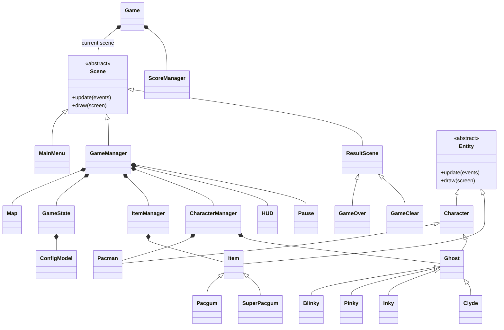
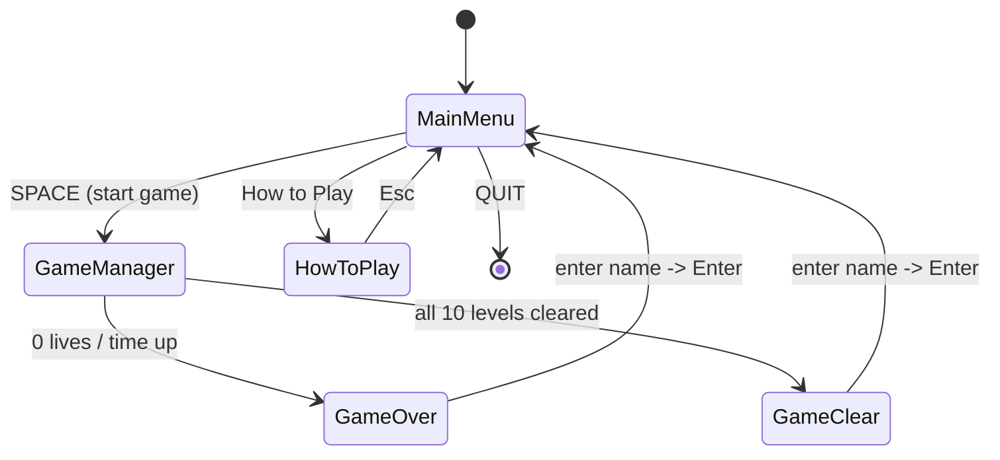
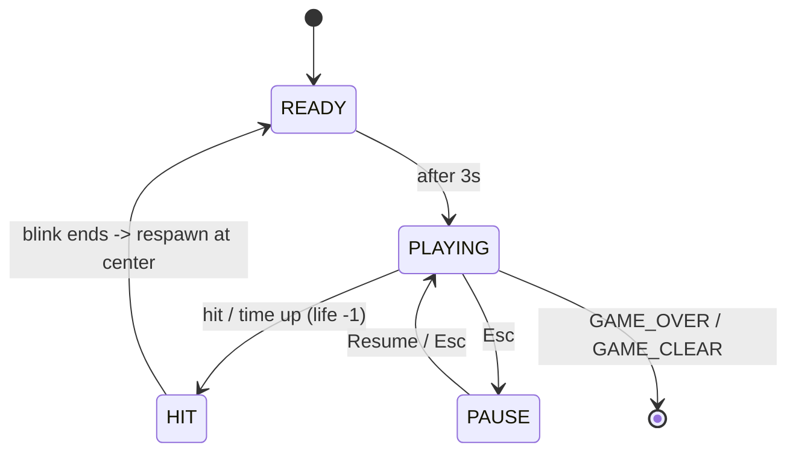
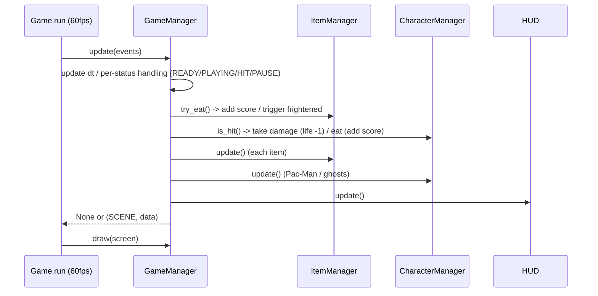

*This project has been created as part of the 42 curriculum by ayhirose, nsato.*

<table>
	<thead>
    	<tr>
      		<th style="text-align:center">English</th>
      		<th style="text-align:center"><a href="README_JP.md">Japanese</a></th>
    	</tr>
  	</thead>
</table>

<h1>
	Pac-Man
</h1> <H2>
    Ghosts! More ghosts!
</H2>

## 📖*Table of Contents*

1. [💡Description](#1-description)
	1. [Requirements and Features](#1-1-requirements-and-features)
	2. [Controls](#1-2-controls)
	3. [Packages Used](#1-3-packages-used)
	4. [📁Directory Structure](#1-4-directory-structure)
2. [✅Instructions](#2-instructions)
	1. [Prerequisites](#2-1-prerequisites)
	2. [How to Run](#2-2-how-to-run)
	3. [Makefile Commands](#2-3-makefile-commands)
3. [⛏Additional Requirements](#3-additional-requirements)
	1. [Configuration (config.json)](#3-1-configuration-configjson)
	2. [Highscore System](#3-2-highscore-system)
	3. [Maze Generation](#3-3-maze-generation)
	4. [Implementation](#3-4-implementation)
	5. [General Software Architecture](#3-5-general-software-architecture)
	6. [Project Management](#3-6-project-management)
	7. [Retrospective (What Went Well / What to Improve)](#3-7-retrospective-what-went-well-and-what-to-improve-next-time)
4. [🌈Resources](#4-resources)
	1. [References](#4-1-references)
	2. [AI Usage](#4-2-ai-usage)


## 1. Description

Recreate the famous arcade game *Pac-Man* using a modern Python codebase, a clean project structure, and a build that can be deployed to a production gaming platform. (from the subject PDF)

### 1-1. Requirements and Features

- **Configuration file loading**  
	Level, score, lives, time limit and more can be changed via commented JSON (`config.json`). Invalid values are clamped to safe defaults and the game continues.  
- **10-level progression**  
	The maze size changes per level. Score and remaining lives carry over between levels. Each level has a time limit.  
- **4 ghosts**  
	Blinky (chase), Pinky (ambush, 4 tiles ahead), Inky (pincer, point-symmetric to Blinky), Clyde (chase/retreat by distance). Each finds the shortest path to its target with BFS.  
- **Pacgum / Super-pacgum**  
	Eating a super-pacgum makes ghosts "frightened" and edible for a short time.  
- **Highscore**  
	Saved to a JSON file for persistence; the top 10 are shown on the main menu.  
- **Cheat mode**  
	For review. Invincibility, level skip, ghost freeze, extra life, speed-up.  
- **UI**  
	Main menu / in-game HUD (score, highscore, lives, level, remaining time) / pause menu / How to Play / game-over and game-clear screens.  

### 1-2. Controls

|Scene|Key|Action|
|-|-|-|
|Main menu|`SPACE`|Start game|
|Main menu / Pause|`↑`/`↓` or `W`/`S`|Move selection|
|Menus (general)|`Enter`|Confirm|
|In game|`W` `A` `S` `D`|Move Pac-Man (up, left, down, right)|
|In game|`Esc`|Pause / Resume|
|Game over / clear|Alphanumeric + `SPACE` / `Backspace`|Enter name (`Enter` to save → menu)|

### 1-3. Packages Used

Package management uses `uv`.
```
"fire>=0.7.1",
"flake8>=7.3.0",
"flake8-bugbear>=25.11.29",
"flake8-pyproject",
"mazegenerator",
"mlx",
"mypy>=1.19.1",
"pep8-naming>=0.15.1",
"pydantic>=2.12.5",
"pygame-ce>=2.5.7",
"pyinstaller>=6.22.0",
```

### 1-4. Directory Structure

```
.
├── Makefile                 # install / run / lint and other routine tasks
├── pac-man.py               # subject-specified entry point
├── config.json              # game settings
├── README.md                # English documentation
├── README_JP.md             # Japanese documentation
├── pyproject.toml           # dependencies / flake8 / mypy settings
├── uv.lock                  # dependency lock file
├── .python-version / .gitignore
│
├── src/
│   ├── __main__.py          # module execution entry point
│   ├── game.py              # main loop / scene switching
│   └── model/
│       ├── game_state.py            # hub that aggregates all state
│       ├── map.py                   # maze generation / drawing / wall check
│       ├── item_manager.py          # pacgum placement / eat detection (ItemManager)
│       ├── character_manager.py     # Pac-Man / ghost control / collision
│       ├── score_manager.py         # score management
│       ├── image_font.py            # draws strings by tiling glyph images (ImageFont)
│       ├── base_model/              # abstract bases / config / shared scenes
│       │   ├── config_model.py      # ConfigModel / LevelModel (pydantic)
│       │   ├── scene.py             # Scene (base)
│       │   ├── entity.py            # Entity (draw / update base)
│       │   ├── character.py         # Character / Direction
│       │   ├── ghost.py             # Ghost (BFS pathfinding / state machine)
│       │   ├── item.py              # Item (base)
│       │   └── result_scene.py      # ResultScene (shared result base)
│       ├── character/               # each character
│       │   ├── pacman.py            # Pacman
│       │   └── blinky/pinky/inky/clyde.py  # 4 ghosts
│       ├── item/                    # pacgum.py / super_pacgum.py
│       └── scene/                   # each scene
│           ├── game_manager.py      # GameManager (core of game progression)
│           ├── mainmenu.py          # MainMenu (title)
│           ├── hud.py               # HUD (in-game info)
│           ├── pause.py             # Pause
│           ├── how_to_play.py       # HowToPlay
│           ├── gameover.py          # GameOver (inherits ResultScene)
│           └── gameclear.py         # GameClear (inherits ResultScene)
│
├── data/
│   ├── assets/              # drawing assets such as font/character images
│   ├── map/                 # mazegenerator wheel and generated output
│   └── score/               # highscore storage (scores.json)
│
└── docs/                    # project management documents
```


## 2. Instructions

### 2-1. Prerequisites

This program requires Python 3.10 or later.  
- This project uses [uv](https://docs.astral.sh/uv/) as its package manager.  
- If uv is not installed, run its official installer script.  

```sh
curl -LsSf https://astral.sh/uv/install.sh | sh
```

### 2-2. How to Run

1. **Install**
```bash
make install
```
Builds the virtual environment (`.venv`) and installs the required dependencies.  
It also installs `mazegenerator-00001-py3-none-any.whl`, which is required by the subject. (`data/map`)  

2. **Run**
```bash
make run
# or the subject-specified launch commands:
uv run python3 pac-man.py config.json
uv run python -m src config.json
```

>**Note**
The program does not necessarily run correctly in a global environment without the dependencies.  
Run it on the `.venv` created earlier by `make install`.  

### 2-3. Makefile Commands

|Command|Description|
|-|-|
|`make` / `make install`|Create the virtual environment and install dependencies (including fetching the `A-Maze-ing wheel`)|
|`make run`|Launch the game (uses `config.json`)|
|`make debug`|Launch with the `pdb` debugger attached|
|`make lint`|Run `flake8 .` and `mypy .` (standard flags)|
|`make lint-strict`|Run `flake8 .` and `mypy --strict .`|
|`make clean`|Remove temporary files such as `__pycache__` and `.mypy_cache`|
|`make fclean`|In addition to `clean`, remove `.venv` / `data`|


## 3. Additional Requirements

### 3-1. Configuration (config.json)

- Settings for launching the game are provided in `config.json`.  
- Lines starting with `#` are treated as comments and ignored; unknown keys are ignored; invalid or missing values are clamped to safe defaults with a log message, and execution continues.  
- Validation is done with `pydantic`(`ConfigModel` / `LevelModel`); out-of-range or type-mismatched values are reset to that item's default.  

|Key|Type|Default|Range / Constraints|
|---|--|--|--|
|`highscore_filename`|string|`"scores.json"`|Filename ending in `.json` only (no directory)|
|`level`|array|10 levels|Each `width`/`height` is `5–25`. Fewer than 10 are padded with defaults; extras beyond 10 keep only the first 10|
|`lives`|int|`3`|`0–5`|
|`pacgum`|int|`42`|`0–100`|
|`points_per_pacgum`|int|`10`|`0–100`|
|`points_per_super_pacgum`|int|`50`|`0–500`|
|`points_per_ghost`|int|`200`|`0–1000`|
|`seed`|int|`42`|`0–1000`|
|`level_max_time`|int|`90`|`30–600`|

>Example: `config.json`
```json
{
  # highscore save filename
  "highscore_filename": "scores.json",
  "lives": 3,
  "pacgum": 42,
  "points_per_pacgum": 10,
  "points_per_super_pacgum": 50,
  "points_per_ghost": 200,
  "seed": 42,
  "level_max_time": 90,
  "level": [
    { "width": 7,  "height": 7  },
    { "width": 11, "height": 11 }
  ]
}
```

### 3-2. Highscore System

**How it works**
- Highscores are persisted to a JSON file (`data/score/<highscore_filename>`) storing player names and scores.  
- Its content is an array of `{"name": ..., "score": ...}`.  
- In game, highscores are loaded at startup and, when the game ends (win or lose), the player enters a name to save.  
- The top 10 are shown on the main menu.  
- Player names are alphanumeric and spaces only, up to 10 characters; scores are processed as non-negative integers.  
- If the file is corrupted / unreadable, it is validated with `pydantic`(`ScoreModel`) and, on failure, falls back to the default (`No One - 0`).  

**Why this approach**
- It depends on no external DB and is self-contained in a single file, which is the simplest way to satisfy the "on project / on disk, either is fine" condition.  
- JSON is human-readable and easy to recover when broken, pairs well with `pydantic` validation, and needs no additional dependency — all of which were deciding factors.  

### 3-3. Maze Generation

The subject PDF specified the following conditions.  
- Do not write your own maze generator.  
- Use the externally assigned `A-Maze-ing`（`mazegenerator`）package as-is, without modifying it.  
	- This project only supports the `mazegenerator` distributed on the subject page.  
- The loader side (`Map`) adapts to the package's interface.  
Therefore, support for the `mazegen` package written by another student is not described here; only support for the distributed `mazegenerator` package is.  

1. **Generation**  
- Create `MazeGenerator((width, height), perfect=False, seed=...)` and get the maze data (2D list) via the `.maze` attribute.  
- Specifying `perfect=False` yields a Pac-Man-friendly maze with no dead ends (strictly, a dead end appears at the central 42 block).  
- Each cell of `.maze` is an integer whose bits represent the presence of a wall in each direction.  

|Bit|Value|Direction|
|-|-|-|
|bit0|1|Wall on top|
|bit1|2|Wall on right|
|bit2|4|Wall on bottom|
|bit3|8|Wall on left|

- For example, the first cell always has walls on the top and left, so it becomes an integer of 9 or more.  
- Cells with `15`(= walls on all four sides) are treated as impassable blocks and excluded from item placement and pathfinding. The `Map` class methods `Map.is_wall()` / `Map.is_moveable()` interpret these bits for wall checks.  
- The first level is generated with a fixed seed; levels from the second onward are generated randomly.  
- Because the subject includes the item `If the generator fails, you must handle the error cleanly.`, maze generation failures are handled so the program can terminate safely.  

### 3-4. Implementation

This section summarizes what technologies and algorithms the above features were built with. For the module/class structure itself, see [3-5 General Software Architecture](#3-5-general-software-architecture).  

- **Rendering / input (limited to MLX-equivalent features)**  
	To comply with the drawing constraint, only the parts of `pygame` that have an equivalent in `minilibx`(pixel placement `set_at` / image blit `blit` / image loading / event polling) are used. `pygame.draw.*`(rectangles, circles, lines) and anti-aliased fonts are not used; text is drawn by horizontally concatenating pre-made glyph images with `ImageFont`.  
- **Main loop**  
	`Game.run()` loops at about 60fps (waiting when `dt` is below `1/60` second), calling the current `Scene`'s `update(events)`→`draw(screen)` every frame. It switches scenes based on `update()`'s return value `(next scene name, data)` (staying on the same scene while `None`).  
- **State aggregation**  
	During gameplay, `GameState` manages all objects (`Map` / `ItemManager` / `CharacterManager`) and parameters (score, lives, level, timer, cheat flags, `game_status`); each manager receives the latest state and updates every frame.  
- **Ghost AI**  
	Each ghost finds the shortest path to its target tile with BFS (breadth-first search, `collections.deque`), switching between chase / frightened (flee) / respawn via a state machine.  
- **Error handling and data validation**  
	The config file and highscores are validated with `pydantic`(`ConfigModel` / `LevelModel` / `ScoreModel`); invalid or missing values are clamped to safe defaults and execution continues. File I/O is handled with context managers, prioritizing not crashing and never emitting a traceback.  
- **Code quality**  
	All functions carry type hints and are checked with `mypy`, and the code conforms to the `flake8` coding standard.  

Note: the runtime state transitions (`game_status`) and the per-frame processing flow are collected as diagrams in [3-5 General Software Architecture](#3-5-general-software-architecture) so they correspond clearly to the structure.  

### 3-5. General Software Architecture

This section gives a high-level overview of the modules/classes that make up the software and their relationships (inheritance, ownership). For how each feature is actually built, see [3-4 Implementation](#3-4-implementation).  

**Main components and their roles**
- `Game`  
	The whole-app main loop. Holds and switches the current `Scene`, and owns `ScoreManager`.  
- `Scene`(abstract base)  
	The common interface for each screen (`update` / `draw`). Inherited by `MainMenu` / `GameManager` / `ResultScene`(→ `GameOver` / `GameClear`).  
- `GameManager`  
	The core of game progression. Holds `GameState`・`Map`・`ItemManager`・`CharacterManager`・`HUD`・`Pause`.  
- `GameState`  
	The hub that aggregates all state such as score, lives, level, and `game_status`. References `ConfigModel`.  
- `Entity`(abstract base)  
	The draw/update base. Inherited by `Character`(→ `Pacman` / `Ghost` → `Blinky`/`Pinky`/`Inky`/`Clyde`) and `Item`(→ `Pacgum` / `SuperPacgum`).  
- `ItemManager` / `CharacterManager`  
	Manage items / characters and perform eat and collision detection.  

Below, the structure (class diagram, scene transitions) and the runtime behavior (state machine, per-frame processing flow) are shown as diagrams.  

**Class diagram**


**Scene transitions (whole app)**


**In-game state (the `game_status` held by `GameManager`)**


**Per-frame processing flow (`GameManager.update`)**


### 3-6. Project Management

This is a team project, developed by splitting tasks per feature and reviewing them using GitHub `Issue` / `Pull Request` / `Projects`.  
Before merging, we did self-review and peer review among members.  
We also discussed among members at appropriate times — such as before/after opening pull requests, or when a piece of work reached a milestone — to decide each person's next task.  
Detailed documents such as timeline, risk analysis, team roles, and acceptance tests are collected in [`docs/`](docs/project_management.md)(the project management directory).

### 3-7. Retrospective: What Went Well and What to Improve Next Time

#### ayhirose

**What went well**
- I'm no longer afraid of Git, which I'm really grateful for. Experiencing issues, pull requests, and merges greatly sharpened my sense of how to run a team project.  
- There were no major reworks after the model design. There were a few argument changes, but the basic OOP design of inheriting objects never wavered.  

**What to improve next time**
- Build the habit of splitting commits. It makes reviewing easier, so I want to keep it in mind.  
- I want to find a lightweight way to divide work within the same class.  

#### nsato

**What went well**
- Being able to work as a team while properly using Git, GitHub issues, pull requests, Projects, Wiki, and so on for the first time was a great learning experience. I want to bring it into my solo work too.  
- Because my teammate did a thorough class design at the start, it was easy to divide work by feature and very easy to make progress. I'm grateful.  
- Thanks to the two points above, I could work on the whole project without stress.  
- Producing a game as the final deliverable, and working on it as a team rather than alone, was itself a very good experience.  
- I got to learn approaches different from my own, which was a good reference, pydantic in particular.  

**What to improve next time**
- On the team  
    - I was worried I leaned on my teammate too much and that the task load became unbalanced. Apart from the team's implementation schedule, I should have set my own personal implementation target dates and done project management on myself. I want to apply this next time.  
- On design  
    - I learned that, depending on the design, a project becomes much easier to run: you can gauge the amount of tasks and plan a schedule, it's clear where to start, the code and directory structure stay clean, and work is easy to divide in a team. I want to learn this deliberately.  
- On the project  
    - In implementing Pac-Man there was a lot of room to go deeper, such as how faithfully to follow the original in spec and features, whether to keep it minimal, hidden commands, and elaborate rendering. I'd like to implement those too if there is time. That said, this time I think completing a deliverable as part of the assignment is what matters, so I'm glad there was a clear stopping point.  
- On Git / GitHub features  
    - I want to master issues, pull requests, Projects, Wiki, and the like. There is apparently something called Worktree, and I want to use that too.  
- On reviewing  
    - I want to organize my review method and flow. I will create a template for AI-assisted review.  
- On things beyond coding skills  
    - Gantt charts, schedule management, task management, design, architecture, requirements definition, functional and non-functional requirements, and frameworks too: there is a lot in the pre-implementation knowledge area where I can't tell the differences or how to proceed. I don't know what to study and acquire, or where to start and how to practice. It was a good experience to see how much there is to learn beyond coding skills, and how much I still lack.  
    - I want to make more use of Obsidian and Anki for the learning and work above.  


## 4. Resources

### 4-1. References

[MinilibX](https://github.com/42school/mlx_CLXV)  
[MiniLibX Python Manual](https://github.com/dde-fite/42_MiniLibX_Python_Manual)  
[A beginner's guide to pygame (JP)](https://www.unixuser.org/~euske/doc/pygame/newbieguide-j.html)  
[Pac-Man chase algorithms seen through analysis videos (JP)](https://www.webcyou.com/?p=10440)  
[Organizing the behavior of Pac-Man and the ghosts (JP)](https://note.com/nice_llama936/n/nf464123fcf1e)  
[The Pac-Man Dossier](http://anonimo0611.web.fc2.com/Pac-Man_Dossier/04.html)  

### 4-2. AI Usage

#### Team

- Copilot  
    Review when submitting pull requests on GitHub.  

#### ayhirose

#### nsato

- Copilot  
    - Ghost-text suggestions via the VSCode extension.  
- Claude  
    - Personal review before submitting pull requests during implementation.  
    - Todo list management.  
    - Creating and tuning Python scripts for asset generation.  
    - README writing.  
- Gemini  
    - Looking up minor questions (e.g., Git commands).  
