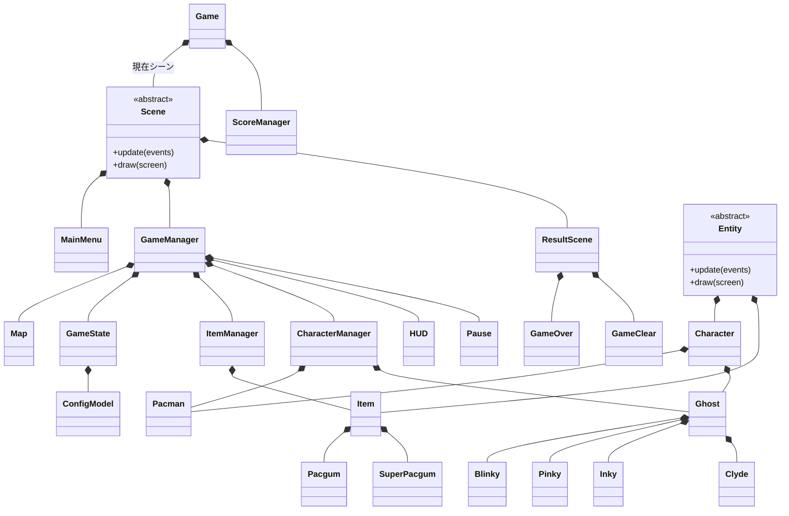
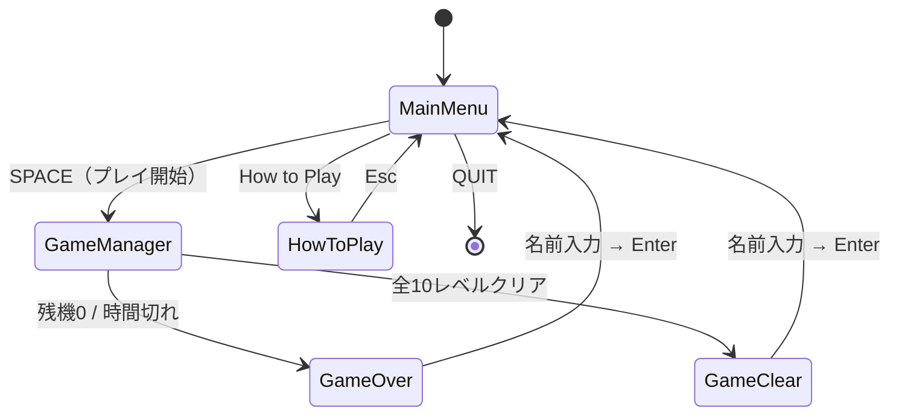
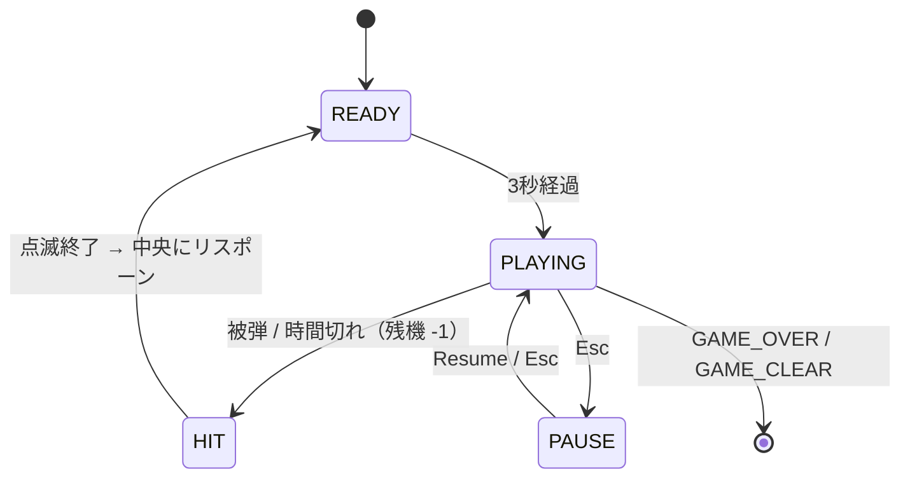
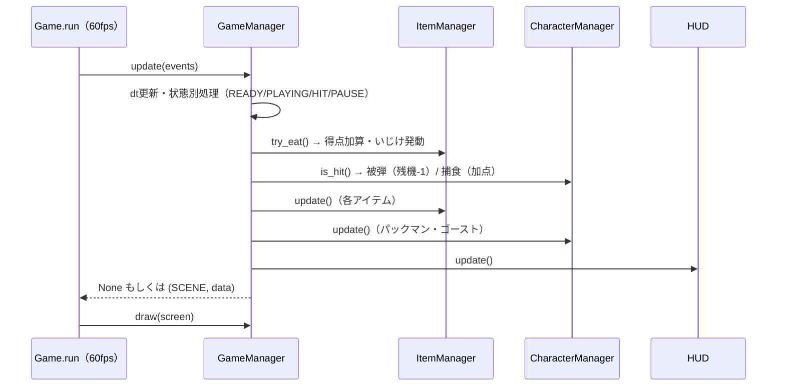

*This project has been created as part of the 42 curriculum by ayhirose, nsato.*

<table>
	<thead>
    	<tr>
      		<th style="text-align:center"><a href="README.md">英語</a></th>
      		<th style="text-align:center">日本語</th>
    	</tr>
  	</thead>
</table>

<h1>
	Pac-Man
</h1> <H2>
    Ghosts! More ghosts!
</H2>

## 📖*目次*

1. [💡概要](#1-概要)
	1. [課題要件と主な機能](#1-1-課題要件と主な機能)
	2. [操作方法](#1-2-操作方法)
    3. [使用したパッケージ](#1-3-使用したパッケージ)
    4. [📁ディレクトリ構成](#1-4-ディレクトリ構成)
2. [✅手順](#2-手順)
	1. [事前準備](#2-1-事前準備)
	2. [実行方法](#2-2-実行方法)
	3. [Makefile内各コマンドの使い方](#2-3-makefile内各コマンドの使い方)
3. [⛏追加要件](#3-追加要件)
	1. [設定ファイル(config.json)](#3-1-設定ファイルconfigjson)
	2. [ハイスコアシステム](#3-2-ハイスコアシステム)
	3. [迷路生成](#3-3-迷路生成)
	4. [実装](#3-4-実装)
	5. [アーキテクチャ](#3-5-アーキテクチャ)
	6. [プロジェクトマネジメント](#3-6-プロジェクトマネジメント)
4. [🌈リソース](#4-リソース)
	1. [参考URL](#4-1-参考url)
	2. [AIの使用について](#4-2-aiの使用について)


## 1. 概要

有名なアーケードゲーム『パックマン』を、最新のPythonコードベース、すっきりとしたプロジェクト構造、そして本番環境へデプロイ可能なビルドを用いて再現します。(課題PDFより)

### 1-1. 課題要件と主な機能

- **設定ファイルの読み込み**  
	コメント付きJSON（`config.json`）でレベル・得点・残機・制限時間などを変更可能。不正値は安全なデフォルトへ丸めて続行。  
- **10レベル進行**  
	レベルごとに迷路サイズが変化。スコアと残機はレベル間で引き継ぐ。制限時間あり。  
- **4体のゴースト**  
	Blinky（追跡）・Pinky（待ち伏せ・4マス先）・Inky（Blinky点対称の挟み撃ち）・Clyde（距離で追跡/退避）。BFSで各ターゲットへ最短経路探索。  
- **パックガム / スーパーパックガム**  
	スーパーパックガム取得でゴーストが一定時間「いじけ」状態になり捕食可能。  
- **ハイスコア**  
	JSONファイルに保存し永続化、メインメニューに上位10件を表示。  
- **チートモード**  
	レビュー用。無敵・レベルスキップ・ゴースト凍結・追加ライフ・加速。  
- **UI**  
	メインメニュー / ゲーム中HUD(スコア・ハイスコア・残機・レベル・残り時間)/ ポーズメニュー / How to Play / ゲームオーバー・ゲームクリア画面。  

### 1-2. 操作方法

|場面|キー|動作|
|-|-|-|
|メインメニュー|`SPACE`|ゲーム開始|
|メインメニュー / ポーズ|`↑`/`↓` または `W`/`S`| 項目選択|
|メニュー各所|`Enter`|決定|
|ゲーム中|`W` `A` `S` `D`|パックマン移動（上・左・下・右）|
|ゲーム中|`Esc`|ポーズ / 再開|
|ゲームオーバー・クリア|英数字 + `SPACE` / `Backspace`|名前入力（`Enter`で保存→メニューへ）|

### 1-3. 使用したパッケージ

パッケージ管理は`uv`を使用しています
```
"fire>=0.7.1",
"flake8>=7.3.0",
"flake8-bugbear>=25.11.29",
"flake8-pyproject",
"mazegenerator",
"mlx",
"mypy>=1.19.1",
"pep8-naming>=0.15.1",
"pydantic>=2.12.5",
"pygame-ce>=2.5.7",
"pyinstaller>=6.22.0",
```

### 1-4. ディレクトリ構成

```
.
├── Makefile                 # install / run / lint などの定型タスク
├── pac-man.py               # 課題指定のエントリポイント
├── config.json              # ゲーム設定
├── README.md                # 英語ドキュメント
├── README_JP.md             # 日本語ドキュメント
├── pyproject.toml           # 依存関係・flake8/mypy 設定
├── uv.lock                  # 依存ロックファイル
├── .python-version / .gitignore
│
├── src/
│   ├── __main__.py          # モジュール実行のエントリポイント
│   ├── game.py              # メインループ・シーン切替
│   └── model/
│       ├── game_state.py            # 全状態を集約するハブ
│       ├── map.py                   # 迷路の生成・描画・壁判定
│       ├── item_manager.py          # パックガム配置・取得判定（ItemManager）
│       ├── character_manager.py     # パックマン/ゴーストの統括・衝突判定
│       ├── score_manager.py         # スコアの管理
│       ├── image_font.py            # 文字画像を並べて文字列を描画（ImageFont）
│       ├── base_model/              # 抽象基底・設定・共通シーン
│       │   ├── config_model.py      # ConfigModel / LevelModel（pydantic）
│       │   ├── scene.py             # Scene(基底)
│       │   ├── entity.py            # Entity(描画・更新の基底)
│       │   ├── character.py         # Character / Direction
│       │   ├── ghost.py             # Ghost(BFS経路探索・状態機械)
│       │   ├── item.py              # Item(基底)
│       │   └── result_scene.py      # ResultScene(リザルト共通基底)
│       ├── character/               # 各キャラクター
│       │   ├── pacman.py            # Pacman
│       │   └── blinky/pinky/inky/clyde.py  # 4体のゴースト
│       ├── item/                    # pacgum.py / super_pacgum.py
│       └── scene/                   # 各シーン
│           ├── game_manager.py      # GameManager(ゲーム進行の中枢)
│           ├── mainmenu.py          # MainMenu(タイトル)
│           ├── hud.py               # HUD(ゲーム中の情報)
│           ├── pause.py             # Pause
│           ├── how_to_play.py       # HowToPlay
│           ├── gameover.py          # GameOver(ResultScene継承)
│           └── gameclear.py         # GameClear(ResultScene継承)
│
├── data/
│   ├── assets/              # フォント画像・キャラクター画像などの描画アセット
│   ├── map/                 # mazegenerator の wheel と生成物
│   └── score/               # ハイスコア保存先（scores.json）
│
└── docs/                    # プロジェクト管理ドキュメント
```


## 2. 手順

### 2-1. 事前準備

このプログラムは Python 3.10以上 での実行が前提です。  
- 本プロジェクトではパッケージ管理ツールとして[uv](https://docs.astral.sh/uv/)を使用します。  
- もしuvがインストールされていない場合、uvの公式インストーラスクリプトを実行します。  

```sh
curl -LsSf https://astral.sh/uv/install.sh | sh
```

### 2-2. 実行方法

1. **インストール**
```bash
make install
```
仮想環境（.venv）を構築し、必要な依存関係をインストールします。  
課題で必須になる、mazegenerator-00001-py3-none-any.whlのインストールも同時に行います。(`data/map`)  

2. **実行**
```bash
make run
# または課題指定の起動方法:
uv run python3 pac-man.py config.json
uv run python -m src config.json
```

>**注意**
プログラムは依存関係のないグローバル環境では必ずしも正しく実行されるとは限りません。  
先に`make install`にてインストールした`.venv`上にて実行してください。  

### 2-3. Makefile内、各コマンドの使い方

|コマンド| 内容|
|-|-|
|`make` / `make install`|仮想環境を作成し依存関係をインストール(`A-Maze-ing wheel`の取得を含む)|
|`make run`|ゲームを起動(`config.json`を使用)|
|`make debug`|`pdb`デバッガ付きで起動|
|`make lint`|`flake8 .`と`mypy .`(標準フラグ)を実行|
|`make lint-strict`|`flake8 .`と`mypy --strict .`を実行|
|`make clean`|`__pycache__`や`.mypy_cache`などの一時ファイルを削除|
|`make fclean`|`clean`に加えて`.venv` / `data`も削除|


## 3. 追加要件

### 3-1. 設定ファイル(config.json)

- ゲームを起動する際の設定は、config.jsonで設定します。  
- `#` で始まる行はコメントとして無視され、未知のキーは無視し、不正・欠落した値は安全なデフォルトに丸めてログを出力し、処理を続行します。  
- バリデーションは`pydantic`(`ConfigModel` / `LevelModel`)で行い、範囲外や型不一致の値も該当項目をデフォルトへ戻します。  

|キー|型|デフォルト|範囲・制約|
|---|--|--|--|
|`highscore_filename`|string|`"scores.json"`|`.json`のファイル名のみ(ディレクトリ指定不可)|
|`level`|array|10レベル分|各`width`/`height`は`5〜25`。10件未満はデフォルトで補充、超過は先頭10件のみ使用|
|`lives`|int|`3`|`0〜5`|
|`pacgum`|int|`42`|`0〜100`|
|`points_per_pacgum`|int|`10`|`0〜100`|
|`points_per_super_pacgum`|int|`50`|`0〜500`|
|`points_per_ghost`|int|`200`|`0〜1000`|
|`seed`|int|`42`|`0〜1000`|
|`level_max_time`|int|`90`|`30〜600`|

例: **`config.json`**
```json
{
  # ハイスコアの保存ファイル名
  "highscore_filename": "scores.json",
  "lives": 3,
  "pacgum": 42,
  "points_per_pacgum": 10,
  "points_per_super_pacgum": 50,
  "points_per_ghost": 200,
  "seed": 42,
  "level_max_time": 90,
  "level": [
    { "width": 7,  "height": 7  },
    { "width": 11, "height": 11 }
  ]
}
```

### 3-2. ハイスコアシステム

**仕組み**
- ハイスコアはJSONファイル(`data/score/<highscore_filename>`)にプレイヤー名とスコアを保存し永続化します。  
- 中身は`{"name": ..., "score": ...}`の配列です。  
- ゲーム内での取り扱いは、起動時にロードし、ゲーム終了時(クリア/ゲームオーバーどちらでも)に名前を入力して保存をします。  
- メインメニューに上位10件を表示します。  
- プレイヤー名は英数字と空白のみ・最大10文字、スコアは非負整数で処理します。  
- ファイルが壊れている／読めない場合は、`pydantic`(`ScoreModel`)で検証し、失敗時はデフォルト(`No One - 0`)へフォールバックします。  

**この方式を選んだ理由**
- 外部DB等に依存せず1ファイルで完結でき、「on project / on disk いずれでも可」という条件に対して最もシンプルに実装が可能だったからです。  
- JSONは人が読みやすく、また壊れても復旧しやすく、`pydantic`による検証と相性が良い点、導入にあたって追加依存も不要な点なども決め手になりました。  

### 3-3. 迷路生成

今回は以下の条件が課題PDFによって指定されていました。  
- 迷路は自作しない。  
- 他者から割り当てられた外部の`A-Maze-ing`（`mazegenerator`）パッケージを改変せずに使用する。  
	- 今回は課題ページで配布された`mazegenerator`にのみ対応。  
- ローダ側(`Map`)がパッケージのインターフェースに合わせる。
よって、別の学生が作成した`mazegen`パッケージへの対応についてはここには記載せず、配布された`mazegenerator`パッケージへの対応のみ記載します。  

1. **生成**  
- `MazeGenerator((width, height), perfect=False, seed=...)`を生成し、`.maze` 属性で迷路データ(2次元リスト)を取得します。  
- `perfect=False`を指定し、行き止まりのない(正確には中心の42ブロックに行き止まりが生まれます)パックマン向けの迷路が得られます。  
- `.maze`の各セルは、各方向の壁の有無をビットで表す整数です。  

|ビット|値|方向|
|-|-|-|
|bit0|1|上に壁|
|bit1|2|右に壁|
|bit2|4|下に壁|
|bit3|8|左に壁|

- 例えば1番目のセルは上と左に必ず壁ができるため、9以上の整数になります。  
- `15`(=四方すべて壁)のセルは不可侵ブロックとして扱い、アイテム配置・経路探索から除外しました。Mapクラスのメソッド、`Map.is_wall()` / `Map.is_moveable()`がこのビットを解釈して壁判定を行います。  
- 1面は固定シードで生成し、2面以降はランダムに生成されます。  
- `If the generator fails, you must handle the error cleanly.`という項目があるため、迷路生成失敗時にも安全に処理を終了できるようになっています。  

### 3-4. 実装

上記の機能を具体的にどんな技術・アルゴリズムで作ったかをまとめます。モジュール・クラスの構成そのものは [3-5 アーキテクチャ](#3-5-アーキテクチャ) を参照してください。  

- **描画・入力（minilibx 相当に限定）**  
	課題の描画制約に合わせ、`pygame`のうち`minilibx`に同等機能があるもの(ピクセル配置`set_at` / 画像転送`blit` / 画像ロード / イベント取得)だけを使用します。`pygame.draw.*`(矩形・円・線)やアンチエイリアス付きフォントは使わず、文字はあらかじめ用意した文字画像を`ImageFont`で横に連結して描画します。  
- **メインループ**  
	`Game.run()`が約60fps(`dt`が`1/60`秒に満たない場合は待機)でループし、現在の`Scene`の`update(events)`→`draw(screen)`を毎フレーム呼び出します。`update()`の戻り値`(次のシーン名, データ)`を見てシーンを切り替えます(`None`の間は同じシーンを継続)。  
- **状態の集約**  
	ゲーム中は`GameState`が全オブジェクト(`Map` / `ItemManager` / `CharacterManager`)とパラメータ(スコア・残機・レベル・タイマー・チートフラグ・`game_status`)を管理し、各マネージャは毎フレーム最新の状態を受け取って更新します。  
- **ゴーストAI**  
	各ゴーストの目標マスまでの経路をBFS(幅優先探索・`collections.deque`)で最短探索し、追跡／いじけ(逃走)／リスポーンを状態機械(ステートマシン)で切り替えます。  
- **エラーハンドリングとデータ検証**  
	設定ファイルとハイスコアは`pydantic`(`ConfigModel` / `LevelModel` / `ScoreModel`)で検証し、不正・欠落値は安全なデフォルトへ丸めて続行します。ファイル入出力はコンテキストマネージャで扱い、トレースバックを出さずクラッシュしないことを重視しています。  
- **コード品質**  
	すべての関数に型ヒントを付け`mypy`で検査し、`flake8`のコーディング規約に準拠しています。  

なお、実行時の状態遷移(`game_status`)と1フレームの処理の流れは、構造との対応が分かりやすいよう [3-5 アーキテクチャ](#3-5-アーキテクチャ) の図にまとめています。  

### 3-5. アーキテクチャ

ソフトウェアを構成するモジュール・クラスと、それらの関係(継承、使用)をまとめます。各機能を具体的にどう作ったかは [3-4 実装](#3-4-実装) を参照してください。  

**主な構成要素と役割**
- `Game`  
	アプリ全体のメインループ。現在の`Scene`を保持して切り替え、`ScoreManager`を持つ。  
- `Scene`（抽象基底）  
	各画面の共通インターフェース(`update` / `draw`)。`MainMenu` / `GameManager` / `ResultScene`(→ `GameOver` / `GameClear`)が継承する。  
- `GameManager`  
	ゲーム進行の中枢。`GameState`・`Map`・`ItemManager`・`CharacterManager`・`HUD`・`Pause`を保持する。  
- `GameState`  
	スコア・残機・レベル・`game_status`など全状態を集約するハブ。`ConfigModel`を参照する。  
- `Entity`（抽象基底）  
	描画・更新の基底。`Character`(→ `Pacman` / `Ghost` → `Blinky`/`Pinky`/`Inky`/`Clyde`)と `Item`(→ `Pacgum` / `SuperPacgum`)が継承する。  
- `ItemManager` / `CharacterManager`  
	アイテム／キャラクターを統括し、取得・衝突判定を行う。  

以下に構造(クラス関係図・シーン遷移)と、実行時の振る舞い(状態機械・1フレームの処理フロー)を図で示します。  

**クラス関係図**


**シーン遷移（アプリ全体）**


**ゲーム中の状態（`GameManager`が持つ`game_status`）**


**1フレームの処理フロー（GameManager.update）**


### 3-6. プロジェクトマネジメント

本プロジェクトはチーム開発で、GitHubの`Issue` / `Pull Request` / `Projects`を用いて機能単位でタスクを分割・レビューして進めました。  
マージ前にはセルフレビューとメンバー相互レビューを行っています。  
またプルリクエストを出す前後等、実装が一区切りついたタイミングなどで適宜メンバー間で話し合い、それぞれの次の作業を分担決定しました。  
タイムライン・リスク分析・チーム分担・受入テスト等詳細なドキュメントは**[`docs/`](docs/)**(プロジェクト管理ディレクトリ)にまとめます。


## 4. リソース

### 4-1. 参考URL

[MinilibX](https://github.com/42school/mlx_CLXV)  
[MiniLibX Python Manual](https://github.com/dde-fite/42_MiniLibX_Python_Manual)  
[初心者のためのpygameガイド](https://www.unixuser.org/~euske/doc/pygame/newbieguide-j.html)  
[パックマン 解析プログラム動画から見る 追跡アルゴリズム](https://www.webcyou.com/?p=10440)  
[６．パックマンやゴーストの挙動を整理する](https://note.com/nice_llama936/n/nf464123fcf1e)  
[The Pac-Man Dossier](http://anonimo0611.web.fc2.com/Pac-Man_Dossier/04.html)  

### 4-2. AIの使用について

#### チームでの使用

- Copilot  
    GitHubでのプルリクエスト送信時のレビュー。  

#### ayhirose

#### nsato

- Copilot  
    - VSCode拡張機能によるゴーストテキストの表示。  
- Claude  
    - 実装時、プルリクエスト送信前の個人レビュー。  
    - Todoリストの管理。  
    – assets作成時のPythonスクリプト作成と調整。  
    - README作成時のPDF対応、日本語版翻訳。
- Gemini  
    - 軽微な疑問点(Gitのコマンド等)の調査。  