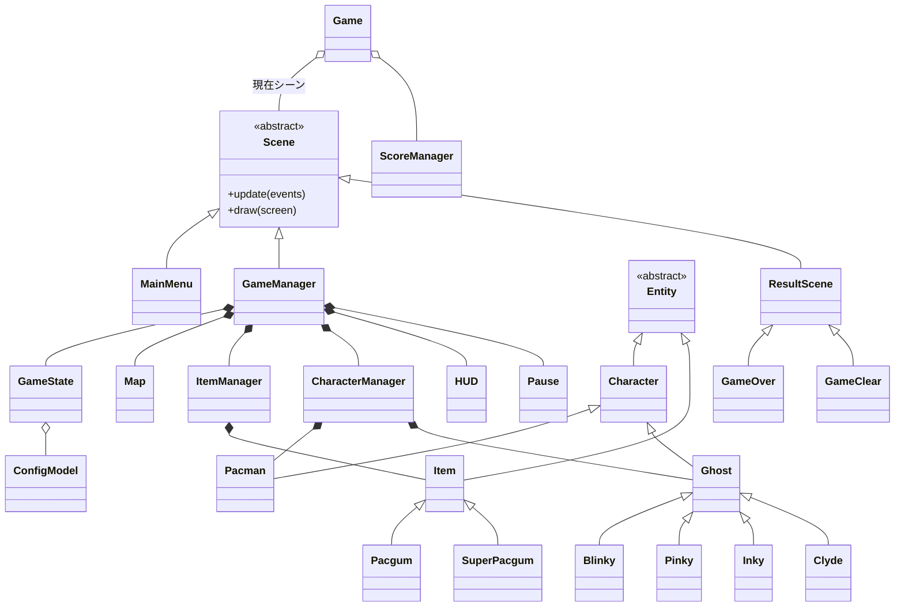
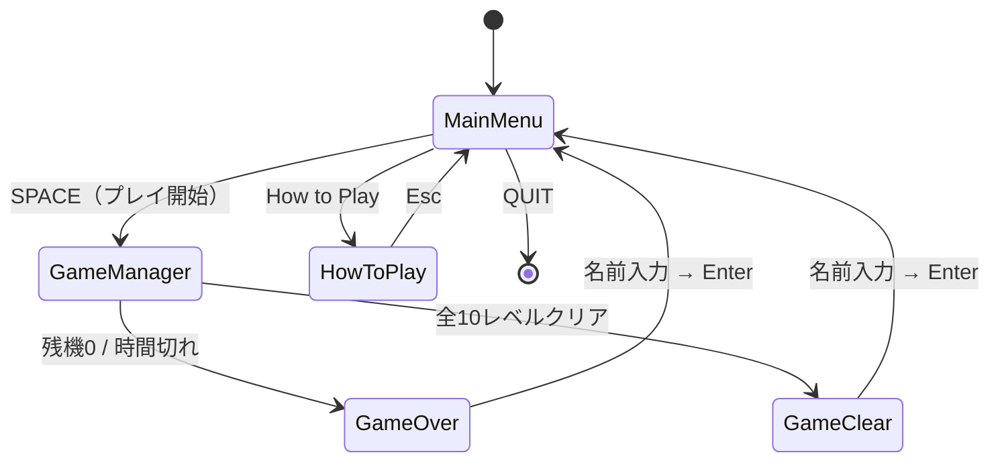
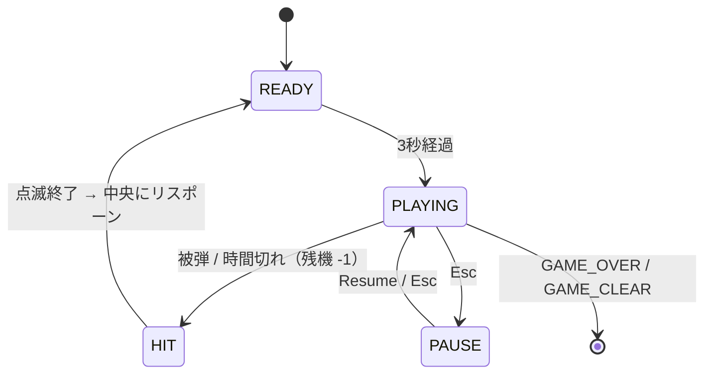

*This project has been created as part of the 42 curriculum by ayhirose, nsato.*

<table>
	<thead>
    	<tr>
      		<th style="text-align:center"><a href="README.md">英語</a></th>
      		<th style="text-align:center">日本語</th>
    	</tr>
  	</thead>
</table>

<h1>
	Pac-Man
</h1> <H2>
    Ghosts! More ghosts!
</H2

## 📖*目次*
1. [💡概要](#1-概要)
    1. [使用したパッケージ](#1-1-使用したパッケージ)
    2. [📁ディレクトリ構成](#1-2-ディレクトリ構成)
2. [✅手順](#2-Instructions)
	1. [事前準備](#2-1-事前準備)
	2. [実行方法](#2-2-実行方法)
	3. [Makefile内各コマンドの使い方](#2-3-makefile内各コマンドの使い方)
3. [⛏追加要件](#3-追加要件)
4. [🌈リソース](#4-リソース)
	1. [参考URL](#4-1-参考url)
	2. [AIの使用について](#4-2-aiの使用について)

## 1. 概要
有名なアーケードゲーム『パックマン』を、最新のPythonコードベース、すっきりとしたプロジェクト構造、そして本番環境へデプロイ可能なビルドを用いて再現します。(課題PDFより)


### 1-1. 使用したパッケージ
>パッケージ管理は`python uv`を使用しています
```
"fire>=0.7.1",
"flake8>=7.3.0",
"flake8-bugbear>=25.11.29",
"flake8-pyproject",
"mazegenerator",
"mlx",
"mypy>=1.19.1",
"pep8-naming>=0.15.1",
"pydantic>=2.12.5",
"pygame-ce>=2.5.7",
"pyinstaller>=6.22.0",
```


### 1-2. ディレクトリ構成**
```
.
├── Makefile                 # install / run / debug / clean / lint などの定型タスク
├── pac-man.py               # 課題指定のエントリポイント（python3 pac-man.py config.json）
├── config.json              # ゲーム設定（コメント付きJSON）
├── README.md                # 英語ドキュメント
├── README_JP.md             # 日本語ドキュメント
├── pyproject.toml           # 依存関係・flake8/mypy 設定
├── uv.lock                  # 依存ロックファイル
├── .python-version / .gitignore
│
├── src/                     # ゲーム本体
│   ├── __main__.py          # モジュール実行の入口（uv run python -m src config.json）
│   ├── game.py              # メインループ・シーン切替（Game）
│   └── model/
│       ├── game_state.py            # 全状態を集約するハブ（GameState）
│       ├── map.py                   # 迷路の生成・描画・壁判定（Map）
│       ├── item_manager.py          # パックガム配置・取得判定（ItemManager）
│       ├── character_manager.py     # パックマン/ゴーストの統括・衝突判定
│       ├── score_manager.py         # ハイスコアの永続化（ScoreManager）
│       ├── image_font.py            # 文字画像を並べて文字列を描画（ImageFont）
│       ├── base_model/              # 抽象基底・設定・共通シーン
│       │   ├── config_model.py      #   ConfigModel / LevelModel（pydantic）
│       │   ├── scene.py             #   Scene（抽象基底）
│       │   ├── entity.py            #   Entity（描画・更新の基底）
│       │   ├── character.py         #   Character / Direction
│       │   ├── ghost.py             #   Ghost（BFS経路探索・状態機械）
│       │   ├── item.py              #   Item（基底）
│       │   └── result_scene.py      #   ResultScene（リザルト共通基底）
│       ├── character/               # 各キャラクター
│       │   ├── pacman.py            #   Pacman
│       │   └── blinky/pinky/inky/clyde.py  # 4体のゴースト（個別AI）
│       ├── item/                    # pacgum.py / super_pacgum.py
│       └── scene/                   # 各シーン
│           ├── mainmenu.py          #   MainMenu（タイトル＋上位10スコア）
│           ├── game_manager.py      #   GameManager（ゲーム進行の中枢）
│           ├── hud.py               #   HUD
│           ├── pause.py             #   Pause
│           ├── how_to_play.py       #   HowToPlay
│           ├── gameover.py          #   GameOver（ResultScene継承）
│           └── gameclear.py         #   GameClear（ResultScene継承）
│
├── data/
│   ├── assets/              # フォント画像・キャラクター画像などの描画アセット
│   ├── map/                 # mazegenerator の wheel と生成物
│   └── score/              # ハイスコア保存先（scores.json）
│
└── docs/                    # 課題PDF・プロジェクト管理ドキュメント
```

## 2. 手順

### 2-1. 事前準備
このプログラムは Python 3.10以上 での実行が前提です。
- 本プロジェクトではパッケージ管理ツールとして[uv](https://docs.astral.sh/uv/)を使用します。  
- もしuvがインストールされていない場合、uvの公式インストーラスクリプトを実行します。  
```sh
make uv-install
```

または  
```sh
curl -LsSf https://astral.sh/uv/install.sh | sh
```

- 仮想環境の作成、依存関係のインストール
```sh
make 
```

または
```sh
make install
```

### 2-2. 実行方法

1. **インストール**
```bash
make install
```
仮想環境（.venv）を構築し、必要な依存関係をインストールします。\
課題で必須になる、mazegenerator-00001-py3-none-any.whlのインストールも同時に行います。(`data/map`)


2. **実行**
```bash
make run
```
メインプログラムのヘルプが表示されます。\
実行方法は多岐に渡るためrunコマンドではヘルプが表示されます。
>**注意**\
プログラムは依存関係のないグローバル環境では必ずしも正しく実行されるとは限りません。\
先に`make install`にてインストールした`.venv`上にて実行してください。\
実行方法
`uv run <実行プログラム>`


### 2-3. Makefile内、各コマンドの使い方
|コマンド| 内容|
|-|-|
| `make` / `make install` | 仮想環境を作成し依存関係をインストール（A-Maze-ing wheel の取得を含む） |
| `make run`              | ゲームを起動（`config.json` を使用）                    |
| `make debug`            | `pdb` デバッガ付きで起動                              |
| `make lint`             | `flake8 .` と `mypy .`（標準フラグ）を実行              |
| `make lint-strict`      | `flake8 .` と `mypy --strict .` を実行           |
| `make clean`            | `__pycache__` や `.mypy_cache` などの一時ファイルを削除   |
| `make fclean`           | `clean` に加えて `.venv` / `data` も削除            |


## 3. 追加要件
### 3-1. 設定ファイル(config.json)について
設定ファイル(config.json)の構造とデフォルト値について説明  
- ゲームを起動する際の設定は、config.jsonで設定します。  
- `#` で始まる行はコメントとして無視され、未知のキーは無視し、不正・欠落した値は安全なデフォルトに丸めてログを出力し、処理を続行します。

|キー|型|デフォルト|範囲・制約|
|---|--|--|--|
| `highscore_filename` | string | `"scores.json"` | `.json` のファイル名のみ（ディレクトリ指定不可）|
| `level`| array| 10レベル分| 各 `width`/`height` は `5〜25`。10件未満はデフォルトで補充、超過は先頭10件のみ使用 |
| `lives`| int| `3`| `0〜5`|
| `pacgum`| int| `42`| `0〜100`|
| `points_per_pacgum`| int| `10`| `0〜100`|
| `points_per_super_pacgum` | int| `50`| `0〜500`|
| `points_per_ghost`| int| `200`| `0〜1000`|
| `seed`| int| `42`| `0〜1000`|
| `level_max_time`| int| `90`| `30〜600`|

例: `config.json`
```json
{
  # ハイスコアの保存ファイル名
  "highscore_filename": "scores.json",
  "lives": 3,
  "pacgum": 42,
  "points_per_pacgum": 10,
  "points_per_super_pacgum": 50,
  "points_per_ghost": 200,
  "seed": 42,
  "level_max_time": 90,
  "level": [
    { "width": 7,  "height": 7  },
    { "width": 11, "height": 11 }
  ]
}
```
バリデーションは `pydantic`（`ConfigModel` / `LevelModel`）で行い、範囲外や型不一致の値は該当項目をデフォルトへ戻します。

### 3-2. ハイスコアシステム
ハイスコアシステムの仕組みと、なぜこの方法で実装することにしたのかを説明  

仕組み
- ハイスコアは JSON ファイル（`data/score/<highscore_filename>`）に保存し永続化します。
	- 中身は `{"name": ..., "score": ...}` の配列です。
- ゲーム内での取り扱いは、起動時にロードし、ゲーム終了時（クリア/ゲームオーバーどちらでも）に名前を入力して保存をします。
	- メインメニューに上位10件を表示します。
- プレイヤー名は 英数字と空白のみ・最大10文字、スコアは 非負整数。
- ファイルが壊れている／読めない場合は、`pydantic`（`ScoreModel`）で検証し、失敗時はデフォルト（`No One - 0`）へフォールバックします。

この方式を選んだ理由
- 外部DB等に依存せず、プロジェクト内の1ファイルで完結でき、「on project / on disk いずれでも可」という条件に対して最もシンプルに実装が可能だったからです。
- JSON は人が読みやすく、また壊れても復旧しやすく、`pydantic` による検証と相性が良い点、導入にあたって追加依存も不要な点なども決め手。


### 3-3. Maze Generationセクション
割り当てられた A-Maze-ing パッケージをどのように使用して迷路を生成するかを説明する  

### 3-4. 実装とアーキテクチャ
実装内容の技術的な概要を記載  
General Software Archtectureセクション: ソフトウェアアーキテクチャ（モジュール、クラス、およびそれらの関係）の大まかな概要を記載  




**シーン遷移（アプリ全体）**



**ゲーム中の状態機械（GameManager の `game_status`）**



**1フレームの処理フロー（GameManager.update）**

```mermaid
sequenceDiagram
    participant Loop as Game.run（60fps）
    participant GM as GameManager
    participant IM as ItemManager
    participant CM as CharacterManager
    participant HUD as HUD
    Loop->>GM: update(events)
    GM->>GM: dt更新・状態別処理（READY/PLAYING/HIT/PAUSE）
    GM->>IM: try_eat() → 得点加算・いじけ発動
    GM->>CM: is_hit() → 被弾（残機-1）/ 捕食（加点）
    GM->>IM: update()（各アイテム）
    GM->>CM: update()（パックマン・ゴースト）
    GM->>HUD: update()
    GM-->>Loop: None もしくは (SCENE, data)
    Loop->>GM: draw(screen)
```


### 3-5. Project Managementセクション
プロジェクトをどのように管理したかの概要と、専用のプロジェクト管理ディレクトリへのリンクを記載  


## 4. リソース

### 4-1. 参考URL

### 4-2. AIの使用について

#### チームでの使用
Copilot  
    GitHubでのプルリクエスト送信時のレビュー。  

#### ayhirose

#### nsato
- Copilot  
    - VSCode拡張機能によるゴーストテキストの表示。  
- Claude  
    - 実装時、プルリクエスト送信前の個人レビュー。  
    - Todoリストの管理。  
    – assets作成時のPythonスクリプト作成と調整。  
    - README作成時
- Gemini  
    - 軽微な疑問点(Gitのコマンド等)の調査。  