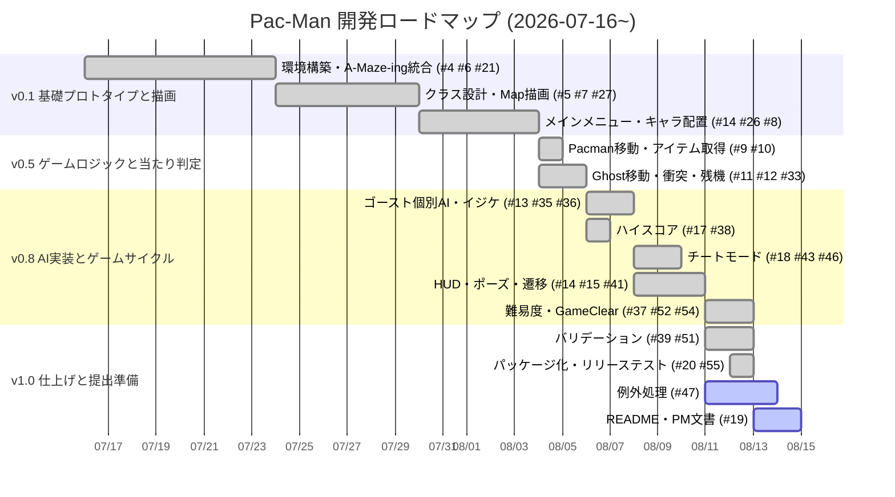
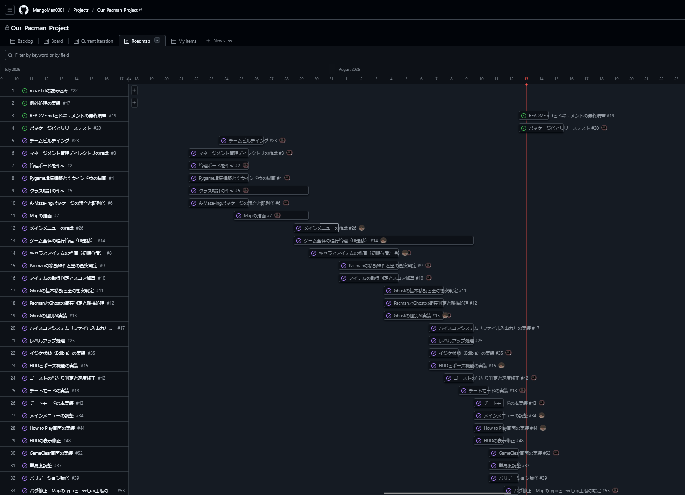
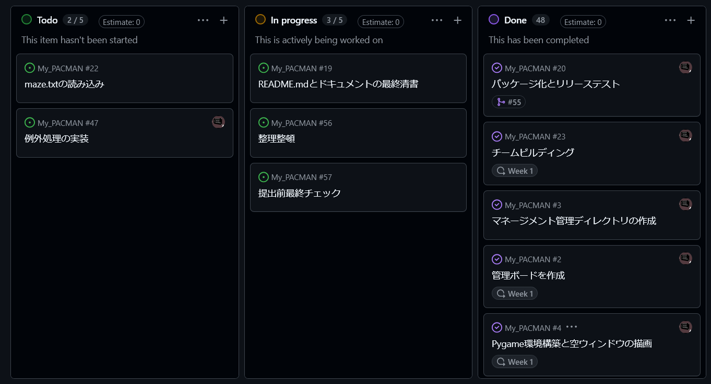

*42 curriculum team project ayhirose, nsato.*

# Project Management — Pac-Man

- **期間**
    2026-07-16~2026-08-14(W29〜W33、約4.5週間)  
- **チーム**
    - ayhirose(GitHub `MangoMan0001`・リポジトリオーナー)  
    - nsato(GitHub `iroha1608`)  
- **使用ツール**  
    - GitHub  
        **Issues**: タスク管理  
        **Milestones**: バージョン計画  
        **Pull Request**: レビュー付きマージ  
        **Projects**: カンバンボード  
- **実績サマリ**
    - Issue 35件(Closed 30 / Open 5)  
    - PR 20件(Merged 19 / Closed-unmerged 1)  
    - コミット 146(ayhirose 58 / nsato 88)  
---

## 1. タイムライン(ロードマップ・ガント・カンバン)

### 1.1. マイルストーン

マイルストーンで段階化し各Issueを紐づけて進めました。  

|マイルストーン|ゴール|Issue数|状態|
|-|-|-|-|
|**v0.1 基礎プロトタイプと描画**|画面が立ち上がり、マップとキャラクターが(動かず)表示される|7|完了|
|**v0.5 ゲームロジックと当たり判定**|キャラクターが動き、ゲームとして機能する|4|完了|
|**v0.8 AI実装とゲームサイクル**|敵AI実装、スタート~ゲームオーバー/クリアの遷移が繋がる|8|完了|
|**v1.0 仕上げと提出準備**|提出できる状態にする|5|進行中(3/5)|

### 1.2 ガント(開発ロードマップ)

### 1.3 カンバン(GitHub Projects)

GitHub**Projects**のボードでTodo / In Progress / Doneを運用(Issue #2「管理ボードを作成」で構築)。  

### 1.4 マージPRの時系列(実績)

|PR|マージ日|著者|内容|
|-|-|-|-|
|#1|07-16|nsato|リポジトリ初期設定(.github)|
|#21|07-24|ayhirose|A-Maze-ing統合・pygame空ウィンドウ|
|#27|07-30|ayhirose|クラス設計・Map描画|
|#28/#30|07-30/31|nsato|メインメニュー|
|#29|07-30|ayhirose|画面サイズ固定化|
|#31|08-04|ayhirose|キャラ・アイテム配置|
|#32|08-04|nsato|メインメニュー修正|
|#33|08-05|ayhirose|ゴースト移動|
|#36|08-06|nsato|ゴースト個別AI|
|#38|08-06|ayhirose|ハイスコアシステム|
|#40|08-08|ayhirose|ゴーストモード管理・チート|
|#41|08-10|nsato|HUD・ポーズ|
|#45|08-10|nsato|メインメニュー調整|
|#46|08-10|ayhirose|チート・ゴースト修正|
|#50|08-12|nsato|HUD表示調整|
|#51|08-13|ayhirose|バリデーション・難易度|
|#54|08-13|ayhirose|GameClear画面|
|#55|08-13|ayhirose|パッケージ化・リリーステスト|

## 2. 進捗トラッキング(計画対比)

### 2.1 マイルストーン計画 対 実績

|マイルストーン|計画|実績|差異|
|-|-|-|-|
|v0.1 基礎プロトタイプ|序盤|07-16~08-04 完了|ほぼ計画通り|
|v0.5 ゲームロジック|中盤前半|08-04~08-06 完了|計画通り|
|v0.8 AI・ゲームサイクル|中盤後半|08-06~08-13 完了|機能多く最長フェーズ|
|v1.0 仕上げ・提出|終盤|08-10~(進行中)|**残 Open: #19 README / #47 例外処理**|

### 2.2 作業量の推移(週別コミット)

|週|コミット|局面|
|-|-|-|
|W29(07/13-19)|3|セットアップ|
|W30(07/20-26)|2|設計中心|
|W31(07/27-08/02)|32|実装立ち上がり|
|W32(08/03-09)|**72(ピーク)**|機能実装が集中|
|W33(08/10-16)|37|調整・仕上げ・文書化|

### 2.3 スコープ調整・未完

- **未着手/保留**
    #22「maze.txtの読み込み」(方針変更で不要化)、#56「整理整頓」、#57「提出前最終チェック」。
- **やり直し**
    PR #49「map resize と name length 修正」は**マージせずClose**(別実装 #51 に統合)。→ §7参照。
- **残タスク**
    #19(README・PM文書)、#47(例外処理の実装)。

## 3. プロジェクト分析と選択(技術的意思決定)

|論点(課題の制約)|選んだ手段|理由・代替案|
|-|-|-|
|グラフィックは**MLX相当**のみ|`pygame`を**画像貼付`blit`/ピクセル`set_at`/画像ロード/イベント**に限定。文字は`ImageFont`で画像連結|`pygame.draw.*`やAAフォントはMLX非対応で使用不可。|
|迷路は**自作禁止・割り当てパッケージを使用**|`A-Maze-ing`(`mazegenerator`)を改変せず利用。`.maze`のビットマスク解釈、`perfect=False`|ローダー(`Map`)側が相手I/Fに適合。|
|**クラッシュ禁止・config更新耐性**|設定/スコアを`pydantic`で検証、不正値はデフォルトへクランプ＋ログ＋続行|未知キー無視・欠落補完が要件。例外はtry/except＋コンテキストマネージャ|
|ハイスコアの永続化(方式自由)|プロジェクト内**JSON 1ファイル**|依存最小・可読・復旧容易・pydantic相性。外部DBは過剰|
|ゴーストの追跡(挙動自由)|**BFS最短経路**＋4体の個別性格(Blinky/Pinky/Inky/Clyde)|原作性格を再現しつつ実装単純|
|再利用可能なアーキテクチャ|`Scene`抽象基底＋`GameManager`中枢＋`GameState`集約|画面追加・状態管理を疎結合に。|

## 4. リスク分析と軽減策

|リスク|影響|可能性|軽減策|結果/状態|
|-|-|-|-|-|
|MLX相当制約からの逸脱|要件不適合|中|使用API対応表で事前検証、`draw.*`禁止を徹底|回避|
|**レビュー時に割り当てA-Maze-ingが再インストール**|迷路が想定と変わる/破綻|中|I/F互換を確認、開発を2.0.2へ寄せMakefileとpyprojectのVersion不一致を解消|対応中|
|config更新(未知キー/範囲外/欠落)|クラッシュ/挙動不良|高|pydanticクランプ＋ログ＋続行|回避|
|クラッシュ源(アセット欠落/生成失敗/空スコア)|提出不合格級|中|例外処理・コンテキストマネージャ。**Issue #47 で継続対応**|一部残|
|デプロイ(Steam/Itch)未了|提出物欠落|中|PyInstaller spec・非公開ビルド(#20/#55で対応)|完了|
|2人チームのバス係数|属人化|中|PR相互レビューで知識共有|緩和|

## 5. チーム体制(担当・意思決定・問題対応)

### 5.1 メンバーと主担当

- **ayhirose(`MangoMan0001`)** — PR 12件 / Issue担当 19件。**基盤・ゲームロジック・仕上げ**が中心
    - プロジェクト管理ボードの作成
    - 環境構築/A-Maze-ing統合(#4 #6 #21)
    - クラス設計/Map描画(#5 #7 #27)
    - キャラ配置(#8 #31)
    - ゴースト移動/AI(#12 #33 #13 #36 #40)
    - ハイスコア(#17 #38)
    - チート/イジケ(#18 #35 #43 #46)
    - GameClear(#52 #54)
    - バリデーション/難易度調整(#37 #39 #51)
    - バグ修正(#42 #53)
    - パッケージ化(#20 #55)

- **nsato(`iroha1608`)** — PR 8件 / Issue担当 7件。**UI・画面系**が中心
    - メインメニュー(#14 #26 #28 #30 #32 #34 #45)
    - 文字描画クラス作成
    - ゲーム進行・UI遷移(#14)
    - HUD・ポーズ(#15 #41 #50)
    - How to Play(#44)
    - ゴースト個別AI(#13 #36)
    - ドキュメントの作成(#19)

### 5.2 意思決定プロセス

- 立ち上げ時にプロジェクト管理、クラス設計を最優先で実施。  
- バージョン計画(v0.1〜v1.0 Milestone)でゴールを合意 → 機能を**Issue**化。  
- 実装は**Issue → `feature/#…`ブランチ → Pull Request → セルフ＋相互レビュー → マージ**のサイクルを回す。  
- 実装の区切り(PR前後)でメンバー間で相談し、次タスクを分担。  

### 5.3 問題対応

- 不具合は**Issue化して追跡**(例: #42 ゴースト当たり判定/速度、#48 HUD表示、#53 Typo/Level_up上限) → PRで修正。  
- 方針転換はPRを**Close**(#49)して別実装に統合。  
- minilibx相当の関数がどこまで含まれるか分からなかったため、色、サイズ、フォント、透明度を変えられるpygameのテキスト描画を使用せずに、あらかじめ用意した文字アセットを使用して画像を貼り付ける方式に転換。  

## 6. 受入テスト計画(テスト項目・発見バグ・修正)

### 6.1 要件別の受入確認
|PDF要件|テスト観点|結果|根拠|
|-|-|-|-|
|config範囲外/欠落値|デフォルトへクランプ＋ログ＋続行|OK|#39 #51|
|未処理例外でクラッシュしない|主要経路で確認|一部継続(#47)|[[Logs/08-13/04_メイン実装_全体レビュー]]|
|迷路生成(perfect=False)|1面固定シード、以降ランダム|OK(版整合は要対応)|#6|
|プレイヤー移動・衝突・残機|壁不可侵・接触で減・中央リスポーン|OK|#9 #11 #12|
|ゴーストAI(4体・イジケ・逃走)|追跡/逃走/リスポーン|OK|#13 #35 #36 #40|
|ハイスコア(上位10・名前入力・永続)|起動ロード/終了保存/表示|OK|#17 #38|
|チートモード(全機能提示)|5種トグル|OK|#18 #43 #46|
|進行(10レベル・引き継ぎ・ポーズ)|一周プレイ|OK|#14 #15 #52 #54|
|UI(メニュー/HUD/ポーズ/結果)|各画面|OK|#26 #34 #41 #48|

### 6.2 発見・修正したバグ(抜粋)
|内容|起票|修正|
|-|-|-|
|Level欠落でクラッシュ / Map Typo / Level_up上限|#53|PR #51・#54系|
|ゴーストの当たり判定・速度|#42|PR #46|
|HUD表示の不整合|#48|PR #50|
|map resize と 名前長(別案)|—|PR #49(Close→#51へ統合)|
|**例外処理の未整備(残)**|#47|対応中|

> レビュー記録(詳細な発見バグ・充足マトリクス): [[Logs/08-13/04_メイン実装_全体レビュー]]・[[Logs/08-13/01_PR51_バリデーション難易度_再レビュー]]・[[Logs/08-13/02_PR54_GameClear画面レビュー]]。

---

## 7. ブロッカー / 対立の要約

- **PRの手戻り(#49)**  
    「map resize と name length 修正」を一度PR化したが、方針を見直して**Closeし #51(バリデーション/難易度)に統合**。二重管理を避けた。

- **マージ順ハザード**  
    #51 → #54 のマージ順で競合し、`fix: post merge main`(`6943b5d`)で解消。

- **A-Maze-ing のバージョン不一致**  
    リポジトリ 2.1.0 開発 / レビュー再インストールは 2.0.2。I/Fは同一だが出力差の懸念 → 2.0.2 へ寄せる方針。

- **lint 完全通過が未達**  
    `src/`に`__init__.py`不足で`mypy`が完走せず、既存エラーが残存(チーム調整中)。
- **提出前の残タスク**  
    #19(README・PM文書)、#47(例外処理)、#56(整理整頓)、#57(最終チェック)。
