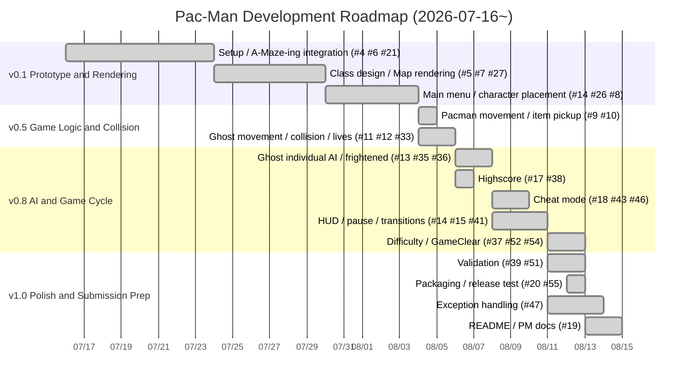

*42 curriculum team project ayhirose, nsato.*

# Project Management — Pac-Man

- **Period**
    2026-07-16~2026-08-14(W29–W33, about 4.5 weeks)  
- **Team**
    - ayhirose(GitHub `MangoMan0001`, repository owner)  
    - nsato(GitHub `iroha1608`)  
- **Tools used**  
    - GitHub  
        **Issues**: task management  
        **Milestones**: version planning  
        **Pull Request**: reviewed merges  
        **Projects**: Kanban board  
- **Actuals summary**
    - 35 issues(30 closed / 5 open)  
    - 20 PRs(19 merged / 1 closed-unmerged)  
    - 146 commits(ayhirose 58 / nsato 88)  
---

## 📖*Table of Contents*
1. [Project Timeline (Gantt, Kanban)](#1-project-timeline-gantt-kanban)
    1. [Milestones](#1-1-milestones)
    2. [Gantt (Development Roadmap)](#1-2-gantt-development-roadmap)
    3. [Kanban (GitHub Projects)](#1-3-kanban-github-projects)
    4. [Merged PR Timeline (Actuals)](#1-4-merged-pr-timeline-actuals)
2. [Actual Progress Tracking (Compared to the Timeline)](#2-actual-progress-tracking-compared-to-the-timeline)
    1. [Milestone Plan vs Actual](#2-1-milestone-plan-vs-actual)
    2. [Workload Trend (Weekly Commits)](#2-2-workload-trend-weekly-commits)
3. [Project Analysis and Associated Choices (Technical Decisions)](#3-project-analysis-and-associated-choices-technical-decisions)
4. [Risk Analysis and Possible Mitigation](#4-risk-analysis-and-possible-mitigation)
5. [Team Organization (Roles, Decision-making, Problem Handling)](#5-team-organization-roles-decision-making-problem-handling)
    1. [Members and Main Responsibilities](#5-1-members-and-main-responsibilities)
    2. [Decision-making Process](#5-2-decision-making-process)
    3. [Problem Handling](#5-3-problem-handling)
6. [Acceptance Test Plan (Features Tested, Bugs Found and Fixed)](#6-acceptance-test-plan-features-tested-bugs-found-and-fixed)
    1. [Acceptance Check by Requirement](#6-1-acceptance-check-by-requirement)
    2. [Bugs Found and Fixed (Excerpt)](#6-2-bugs-found-and-fixed-excerpt)
7. [Summary of Blocking Points and Conflicts](#7-summary-of-blocking-points-and-conflicts)

## 1. Project Timeline (Gantt, Kanban)

### 1-1. Milestones

We staged the work with milestones and linked each issue to one.  

|Milestone|Goal|Issues|Status|
|-|-|-|-|
|**v0.1 Prototype and Rendering**|The window comes up and the map and characters are displayed (not yet moving)|7|Done|
|**v0.5 Game Logic and Collision**|Characters move and it works as a game|4|Done|
|**v0.8 AI and Game Cycle**|Enemy AI implemented; start~game-over/clear transitions connected|8|Done|
|**v1.0 Polish and Submission Prep**|Get it into a submittable state|5|Done|

### 1-2. Gantt (Development Roadmap)

### 1-3. Kanban (GitHub Projects)

We ran Todo / In Progress / Done on a GitHub **Projects** board (built in issue #2 "Create the management board").  

### 1-4. Merged PR Timeline (Actuals)

|PR|Merged|Author|Content|
|-|-|-|-|
|#1|07-16|nsato|Repository initial setup (.github)|
|#21|07-24|ayhirose|A-Maze-ing integration, empty pygame window|
|#27|07-30|ayhirose|Class design, Map rendering|
|#28/#30|07-30/31|nsato|Main menu|
|#29|07-30|ayhirose|Fixed window size|
|#31|08-04|ayhirose|Character and item placement|
|#32|08-04|nsato|Main menu fixes|
|#33|08-05|ayhirose|Ghost movement|
|#36|08-06|nsato|Ghost individual AI|
|#38|08-06|ayhirose|Highscore system|
|#40|08-08|ayhirose|Ghost mode management, cheat|
|#41|08-10|nsato|HUD, pause|
|#45|08-10|nsato|Main menu adjustments|
|#46|08-10|ayhirose|Cheat, ghost fixes|
|#50|08-12|nsato|HUD display adjustments|
|#51|08-13|ayhirose|Validation, difficulty|
|#54|08-13|ayhirose|GameClear screen|
|#55|08-13|ayhirose|Packaging, release test|

## 2. Actual Progress Tracking (Compared to the Timeline)

### 2-1. Milestone Plan vs Actual

|Milestone|Plan|Actual|Variance|
|-|-|-|-|
|v0.1 Prototype|Early|Done 07-16~08-04|Mostly on plan|
|v0.5 Game Logic|Early-mid|Done 08-04~08-06|On plan|
|v0.8 AI / Game Cycle|Late-mid|Done 08-06~08-13|Most features; longest phase|
|v1.0 Polish / Submission|Late|Done 08-10~08-15|On plan|

### 2-2. Workload Trend (Weekly Commits)

|Week|Commits|Phase|
|-|-|-|
|W29(07/13-19)|3|Setup|
|W30(07/20-26)|2|Design-focused|
|W31(07/27-08/02)|32|Implementation ramp-up|
|W32(08/03-09)|**72 (peak)**|Feature implementation concentrated|
|W33(08/10-16)|37|Adjustment, polish, documentation|

## 3. Project Analysis and Associated Choices (Technical Decisions)

|Consideration (subject constraint)|Chosen approach|Reason / alternatives|
|-|-|-|
|Packages to adopt|`Pydantic`|We needed file loading, so we introduced it first.|
|Graphics limited to **MLX-equivalent**|Limited `pygame` to **image blit `blit` / pixel `set_at` / image loading / events**; text is concatenated glyph images via `ImageFont`|`pygame.draw.*` and AA fonts are not MLX-supported, so they cannot be used.|
||`Pygame`|We initially planned to use Arcade, which allows modern development, but a PDF update added the requirement that only MiniLibX-equivalent features may be used, so Pygame, which builds more basic drawing logic, was adopted.|
|Maze must not be self-made; use the assigned package|Use `A-Maze-ing`(`mazegenerator`) without modification; interpret the `.maze` bitmask; `perfect=False`|The loader (`Map`) adapts to the package's interface.|
|**No crashes; resilient to config edits**|Validate config/score with `pydantic`, clamp invalid values to defaults + log + continue|Ignoring unknown keys and filling missing ones are requirements. Exceptions handled with try/except + context managers.|
|Highscore persistence (method is free)|A single **JSON file** inside the project|Minimal dependencies, readable, easy to recover, good `pydantic` fit. An external DB is overkill.|
|Ghost chasing (behavior is free)|**BFS shortest path** + 4 individual personalities (Blinky/Pinky/Inky/Clyde)|Reproduces the original personalities while keeping the implementation simple.|
|Reusable architecture|`Scene` abstract base + `GameManager` core + `GameState` aggregation|Keeps screen additions and state management loosely coupled.|

**Model design**
- Because almost all classes share the same methods and arguments, we could prepare a common data class. When designing and adding a new class, the need to feed in and format data from scratch decreased, and the work to divide became clear.

## 4. Risk Analysis and Possible Mitigation

|Risk|Impact|Likelihood|Mitigation|Result/Status|
|-|-|-|-|-|
|Deviation from the MLX-equivalent constraint|Non-compliance|Medium|Verify in advance with an API mapping table; strictly forbid `draw.*`|Avoided|
|Config edits (unknown keys / out of range / missing)|Crash / misbehavior|High|pydantic clamp + log + continue|Avoided|
|Crash sources (missing assets / generation failure / empty score)|Submission-failing level|Medium|Exception handling, context managers.|Partially remaining|
|Deployment (Steam/Itch) not done|Missing deliverable|Medium|PyInstaller spec, private build (handled in #20/#55)|Done|
|Bus factor of a 2-person team|Knowledge silos|Medium|Share knowledge via mutual PR review|Mitigated|

>Asset loading error caused by the difference between Windows (case-insensitive) and Linux/WSL (case-sensitive) (the Pacman vs pacman integration bug) -> unified the naming to eliminate the conflict

## 5. Team Organization (Roles, Decision-making, Problem Handling)

- Members split a working branch per issue -> review with the other member -> merge into main; work was divided this way.  
- At review time, the two of us discussed which issue to do next. We each chose a nearby issue derived from the feature we first implemented.  
- We tentatively set the issues up to release that became visible during model design. Because tasks separated by area at the issue level (floating tasks that don't conflict at merge) were easy to find, there was never a moment where one person's work stalled waiting on the other's, which raised work efficiency.

### 5-1. Members and Main Responsibilities

- **ayhirose(`MangoMan0001`)** — 12 PRs / 19 issues assigned. Centered on **foundation, game logic, polish**
    - Created the project management board
    - Setup / A-Maze-ing integration (#4 #6 #21)
    - Class design / Map rendering (#5 #7 #27)
    - Character placement (#8 #31)
    - Ghost movement / AI (#12 #33 #13 #36 #40)
    - Highscore (#17 #38)
    - Cheat / frightened (#18 #35 #43 #46)
    - GameClear (#52 #54)
    - Validation / difficulty tuning (#37 #39 #51)
    - Bug fixes (#42 #53)
    - Packaging (#20 #55)

- **nsato(`iroha1608`)** — 8 PRs / 7 issues assigned. Centered on **UI and screens**
    - Main menu (#14 #26 #28 #30 #32 #34 #45)
    - Created the text-rendering class
    - Game progression / UI transitions (#14)
    - HUD / pause (#15 #41 #50)
    - How to Play (#44)
    - Ghost individual AI (#13 #36)
    - Documentation (#19)

### 5-2. Decision-making Process

- At kickoff, we prioritized project management and class design.  
- Agreed on goals via version planning (v0.1–v1.0 milestones) -> turned features into **Issues**.  
- Implementation cycles through **Issue -> `feature/#…` branch -> Pull Request -> self + mutual review -> merge**.  
- At implementation breakpoints (around PRs), members consulted and divided the next tasks.  

### 5-3. Problem Handling

- Defects are **tracked as issues** (e.g. #42 ghost collision/speed, #48 HUD display, #53 typo/Level_up cap) -> fixed via PR.  
- A change of direction **Closes** the PR (#49) and integrates it into another implementation.  
- Because we weren't sure how far the minilibx-equivalent functions extend, we switched away from pygame text rendering (which can change color, size, font, and transparency) to a method of pasting images using pre-made character assets.  

## 6. Acceptance Test Plan (Features Tested, Bugs Found and Fixed)

- We had a habit of running an AI review before member review. It wasn't intended from the start, but it helped enumerate the items worked on in a branch and analyze the risk of the impact scope.  

### 6-1. Acceptance Check by Requirement

|PDF requirement|Test viewpoint|Result|Evidence|
|-|-|-|-|
|Config out-of-range/missing values|Clamp to default + log + continue|OK|#39 #51|
|No crash on unhandled exceptions|Checked on main paths|OK|#47|
|Maze generation (perfect=False)|Fixed seed on level 1, random afterward|OK|#6|
|Player movement / collision / lives|Walls impassable, decrement on contact, center respawn|OK|#9 #11 #12|
|Ghost AI (4 ghosts / frightened / flee)|Chase / flee / respawn|OK|#13 #35 #36 #40|
|Highscore (top 10 / name entry / persistence)|Load on startup / save on end / display|OK|#17 #38|
|Cheat mode (all features presented)|5 toggles|OK|#18 #43 #46|
|Progression (10 levels / carry-over / pause)|One full playthrough|OK|#14 #15 #52 #54|
|UI (menu/HUD/pause/result)|Each screen|OK|#26 #34 #41 #48|

### 6-2. Bugs Found and Fixed (Excerpt)

|Content|Reported|Fixed|
|-|-|-|
|Crash on missing Level|#53|PR #51, #54 series|
|Ghost collision / speed|#42|PR #46|
|Found a bug where the HUD implementation caused infinite level-up and time was not displayed accurately|#48|PR #50|
|Items could not be picked up when speeding up in cheat mode||Changed the collision condition from an exact match of the character outline's pixel coordinates to whether it lies between the character's center and its outline|

## 7. Summary of Blocking Points and Conflicts

- **PR rework (#49)**  
    We once turned "map resize and name length fix" into a PR, but revisited the approach and **closed it, integrating into #51 (validation/difficulty)**. This avoided double management.

- **Merge-order hazard**  
    The #51 -> #54 merge order conflicted and was resolved with `fix: post merge main`.

- Because we basically divided work by feature, conflicts almost never occurred. Once, by mistake, running git stash pop outside the working branch wiped the working branch's changes and caused a conflict, but we handled it with the IDE's features.  
